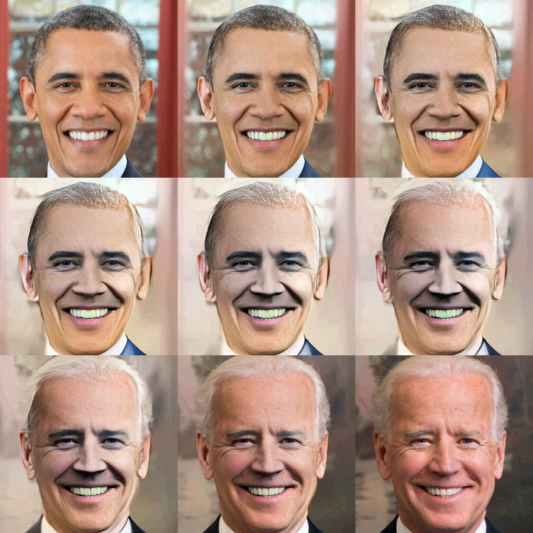

# MegaPixels Ch 4

Interpolating Visual Identity: For Aarhus University seminar on "Facial Machines and obfuscation in an age of biometrics and neural networks" Nov 2018

Challenge: given a set of people, find the most similar person and create a merged synthetic face that is a _biometric midpoint_ between 2 identities





## Setup Glow 

<https://github.com/openai/glow/>

Set a project folder
- `export glow=/path/to/your/asset/glow/`
- `export dlib=/path/to/your/asset/dlib/`

Download pretrianed OpenAI Glow files:

```
chmod +x setup.sh
./setup.sh
```


Edit folder/file paths in your `ch4/settings/app_cfg.py` file

## Setup Python Environemnt

- Clone project and submodules `git clone --recursive https://github.com/adamhrv/megapixels`
- install [virutalenvwrapper](https://virtualenvwrapper.readthedocs.io/en/latest/install.html)
- `mkvirtualenv megapixels -p python3.5`
- `workon megapixels`
- `pip install -r requirements.txt`
- for cpu change `tensorflow-gpu` to `tensorflow`

## Run app

- `workon megapixels`
- `python cli.py`
- `python cli.py sanity` top test imports

## Run app commands

```
Commands:
  dedupe      Deduplicate images
  encode      Generates face encodings for all identities
  glow        Synthesize new face using openai/glow
  match_glow  Glow best matched face
  server      Runs server
  slugify     Slugifies identity directories
  swap        Clone person A's face to person B
  test        Test code snippets here
  match  Finds best matches
```

Dedupe

- `python cli.py dedupe`
- after using <https://github.com/hardikvasa/google-images-download> to download images, run `dedupe` on the folders to remove poor quality images

Encode

- `python cli.py encode`
- encodes all the approved face images into an ecodings file (ie `encodings.json`)

Glow

- `python cli.py glow -a image_a.jpg -b image_b.jpg`
- this will generate a openai/glow match between file A and B, if faces exist in both

Match Glow

- `python cli.py match_glow -i image.jpg`
- finds the best facial match then sends the best matched image to the glow processor

Server

- `python cli.py server`
- runs the Flask server at (default) `http://localhost:5000`

Swap

- `python cli.py swap`
- not currently using. It uses the code from <https://matthewearl.github.io/2015/07/28/switching-eds-with-python/> to swap faces between two images

Test

- `python cli.py test`
- this is only for running test code snippets

Test Match

- `python cli.py match`
- finds the best match(es) and displays to the screen


## Run Server

Run the app as a server using `python server.py`

## JSON Endpoint

- POST an image and receive JSON response
- `curl -i -X POST -H "Content-Type: multipart/form-data" -F "img_query=@~/Downloads/test_face.jpg" http://localhost:5000/json`

Result
```json
{
  "match": "dataset/person1/image1.jpg",
  "match_all": [
    "dataset/person1/image12.jpg",
    "dataset/person1/image41.jpg",
    "dataset/person1/image3.jpg"
  ],
  "morph": "processed/5eaa2372-a217-4063-9f3a-d80b1f347d84_01.jpg",
  "morph_all": [
    "processed/5eaa2372-a217-4063-9f3a-d80b1f347d84_00.jpg",
    "processed/5eaa2372-a217-4063-9f3a-d80b1f347d84_01.jpg",
    "processed/5eaa2372-a217-4063-9f3a-d80b1f347d84_02.jpg"
  ],
  "success": true,
  "upload": "uploads/5ea32372-a217-4063-9f3a-d80b1f347d84.jpg"
}
```

